## 计算机.浮点数

这里将以IEEE754浮点数定义来讨论浮点数在内存中是如何存储的

推荐几个浮点数转换和计算的在线工具：

*   [binaryconvert](http://www.binaryconvert.com/result_double.html?decimal=049051046052053054)
*   [IEEE754 Calculator](http://weitz.de/ieee/)
*   [FloatConverter](https://www.h-schmidt.net/FloatConverter/IEEE754.html)
*   用它们可以看到一个浮点数的二进制是什么样子：
*   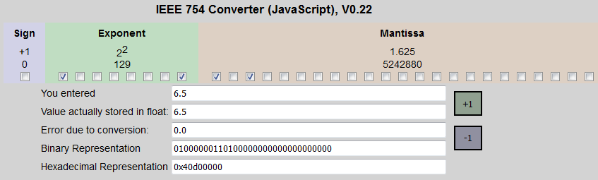

### 定点数

与浮点数相对的是定点数：小数点位于固定的位置

比如一个16bit定点数、我们可以约定前8bit表示整数、后8bit表示小数

像是00000011010000000就表示6.5，我们用小数点把前8bit和后8bit分开就里面能看出来：000000110.10000000，前8bit(整数)为000000110 = 6、后8bit(小数)为10000000 = 0.5

### 浮点数

相对于定点数、浮点数的小数点位置不是一个固定的位置

在IEEE754浮点数定义中、用一个偏移量来记录小数点的位置，一个浮点数被分为三个部分来进行记录

以64bit的double为例：
$$
(double)num = (-1)^S * (1.0 + M) * 2^{e}
$$

s：符号位(1bit)，0：这个数为整数、1：这个数为负数

e：(e - 1023)记录了小数点的位置的偏移(e用11bit表示)、用它可以确定小数点的位置

M：尾数(52bit)标识有效数字，前面是整数部分、后面是小数部分，一共52bit，小数点的位置由e的值计算出来

这是浮点数的IEEE754定义，下面我们进行double的十进制和二进制之间的相互转换

#### 十进制转二进制

我们将十进制的(double)126.921转为IEEE754定义下的二进制

首先这是个正数、所以符号位 s = 0 

接下来、将正数和小数部分都转为二进制(省略计算方法和过程)：

*   整数部分126 = 0x7E = 0b1111110
*   小数部分0.921 ≈ 0b1110 1011 1100 0110 1010 0111 1110 1110 0101 0110 0000 0100 0001

将整数和小数部分连接起来：

1111110.1110 1011 1100 0110 1010 0111 1110 1110 0101 0110 0000 0100 0001

小数点向左移6位，使结果只留1位整数、且整数为1：

1.111110 1110 1011 1100 0110 1010 0111 1110 1110 0101 0110 0000 0100 0001 * 2^6

根据定义：

*   (e-1023) = 6、所以e = 1029 = 10000000101
*   M = 1111 1011 1010 1111 0001 1010 1001 1111 1011 1001 0101 1000 0001(去掉了那1位整数、同时取前52bit)

所以、这个double数的二进制为：

0 **10000000101** 1111 1011 1010 1111 0001 1010 1001 1111 1011 1001 0101 1000 0001

= 0x405FBAF1A9fB9581

这个数值和在线工具计算出来的基本一样(末尾的误差是由于小数部分转二进制不能尽导致的)：

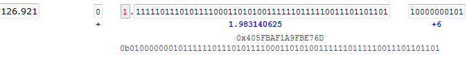

#### 二进制转十进制

下面是一个double型数据在内存中的样子

0100000001000110110011110101110000101000111101011100001010001111 = 0x4046CF5C28F5C28F

我们先找到它的小数点的位置、再还原它的十进制数值

首先、我们将它的三个部分分开来：

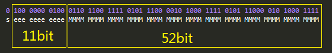

s = 0、表示这是个正数

e = 100 0000 0100 = 1028 

M = 0110 1100 1111 0101 1100 0010 1000 1111 0101 11000 010 1000 1111

(e-1023) = 1028 - 1023 = 5、这表示小数点偏移量为5

怎么由这个偏移量找到小数点的位置呢？

我们先将尾数部分加上1.0、得到(1.0 + M)：

(1.0 + M) = 0001 + M = 0001.0110 1100 1111 0101 1100 0010 1000 1111 0101 11000 010 1000 1111

(e-1023) = 5、为正数、就将(1.0 + M)的小数点向右移动5位(如果为负、就向左移；定义中引入1023这个数值(Bias)、可以将结果表达为一个正数或负数、用于表示移动方向)

得到：0001 0110 1.100 1111 0101 1100 0010 1000 1111 0101 11000 010 1000 1111

小数点的位置就将整数和小数分开了：

*   整数 = 0001 0110 1 = 45
*   小数 = 100 1111 0101 1100 0010 1000 1111 0101 11000 010 1000 1111 ≈ 0.62

所以这个double数值为45.62

这和在线计算工具的结果基本一致：

### 浮点数的特殊值

| e    | M    | num         | Note                                                         |
| ---- | ---- | ----------- | ------------------------------------------------------------ |
| 0    | !=0  | 0.f*2^-1022 | 非规范数值                                                   |
| 0    | 0    | ±0          | 数值上：+0 == -0；1 / -∞ = -0, 1 / +∞ = +0,数值一样但方向不一样 |
| 7FF  | 0    | ±∞          | 用于表达计算结果上下界overflow、比如两个极大数相乘或n / 0.f = ∞ |
| 7FF  | !=0  | NaN         | not a number，表示计算有错误                                 |
| 其他 | 其他 | 正常的数值  | 规范数值                                                     |

结果为NaN的操作：

| 操作   | 表达式               |
| ------ | -------------------- |
| +      | ∞ + (-∞)             |
| *      | 0 * ∞                |
| /      | 0.f / 0.f、∞ / ∞     |
| %      | x % 0.f、∞ % y       |
| sqrt() | sqrt(x)，其中x < 0.f |
| 其他   | 其他                 |

##### 在线工具计算的特殊值

非规范数值(0x0008000000000000 | 0x800C000000000000)：

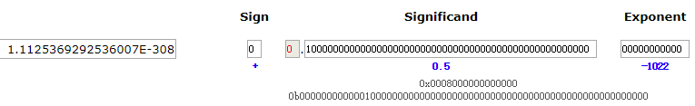

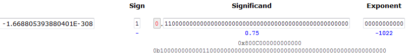

±0.0(0x8000000000000000 | 0x0000000000000000)：

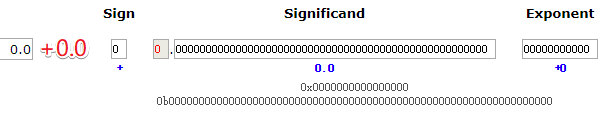

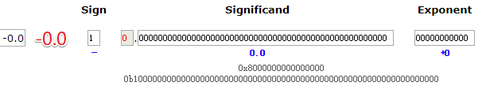

无穷大(0x7FF0000000000000 | 0xFFF0000000000000)：

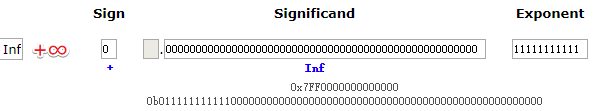

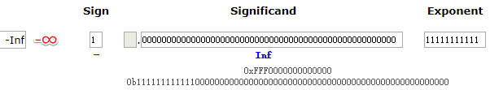

NaN(0xFFF8000000000000)：

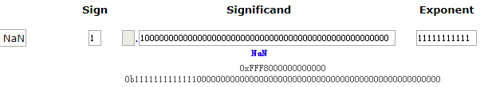

e - 1023 = 0 的情况(小数点不移动)(0x3FF8000000000000)：

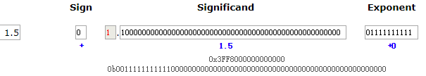

参考资料：[程序员必知之浮点数运算原理详解](https://www.cnblogs.com/icmzn/p/5060195.html)
